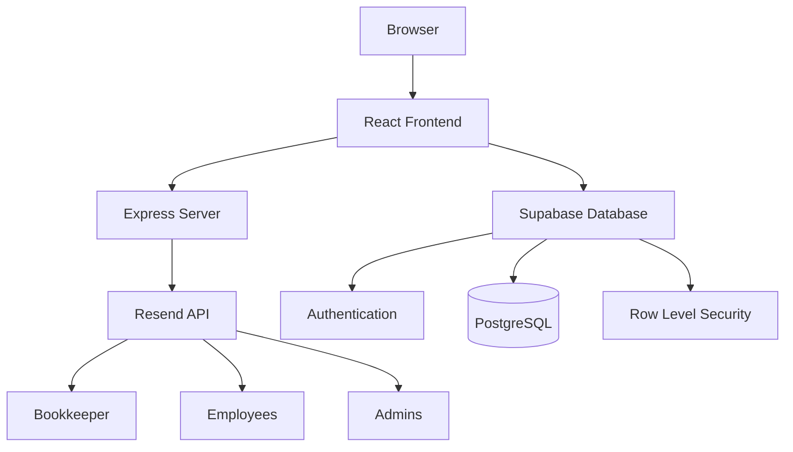

# 🎉 Ollie Timesheets - Complete Setup Summary

Congratulations! Your timesheet app now has **Resend email integration** and **Supabase database** support. Here's everything that was added:

## ✅ What Was Implemented

### 1. Backend Email Server ✉️

**Location**: `server/` directory

- **Express server** running on port 3001
- **5 email endpoints** for all notification types
- **Rate limiting** to prevent spam
- **Email validation** for security
- **Professional HTML email templates**

**Files created:**
- `server/index.js` - Main Express server
- `server/emailService.js` - Resend API integration
- `server/emailTemplates.js` - Beautiful HTML email templates
- `server/package.json` - Backend dependencies
- `server/.env` - Your Resend API key (already configured!)

### 2. Email Features 📧

All emails use beautiful, professional HTML templates with your branding:

1. **Bookkeeper Reports** - Send formatted payroll reports via email
2. **Team Invitations** - Welcome new employees with onboarding instructions
3. **Missing Clockout Alerts** - Automatic reminders for incomplete timecards
4. **Change Request Notifications** - Alert admins of pending approvals
5. **Approval Notifications** - Tell employees when requests are processed

### 3. Supabase Database Integration 🗄️

**Location**: `supabase-schema.sql` + `supabaseClient.ts`

- **Complete database schema** with 5 tables
- **Row Level Security (RLS)** for data protection
- **4 user roles**: Owner, Admin, Employee, Accountant
- **Multi-user access** - Your accountant can now log in!
- **Real-time sync** across devices
- **Secure authentication** via Supabase Auth

**Tables created:**
- `profiles` - User accounts and roles
- `employees` - Employee records
- `time_entries` - Clock in/out data
- `breaks` - Break tracking
- `settings` - Company configuration

### 4. Frontend Updates 🎨

- **API client** (`apiClient.ts`) for email endpoints
- **Supabase client** (`supabaseClient.ts`) for database
- **Updated fonts** to beautiful Raleway
- **Team invitation flow** in add employee modal
- **Bookkeeper report** now sends via email (not mailto)
- **Automatic notifications** built into the store

### 5. Documentation 📚

Comprehensive guides for you and your team:

- `README.md` - Full project documentation
- `SUPABASE_SETUP.md` - Step-by-step Supabase setup
- `TESTING_GUIDE.md` - How to test all email features
- `env.example` - Environment variable template

## 🚀 Quick Start Guide

### Step 1: Install Dependencies (if not done)

```bash
cd "Ollie Timesheet"
npm install
cd server && npm install && cd ..
```

### Step 2: Set Up Supabase

Follow the detailed guide: **`SUPABASE_SETUP.md`**

Quick checklist:
1. Create Supabase project
2. Run `supabase-schema.sql` in SQL Editor
3. Create your owner user
4. Get API keys
5. Create `.env.local` with your Supabase credentials

### Step 3: Start Everything

```bash
# Terminal 1: Backend email server
npm run server:dev

# Terminal 2: Frontend app
npm run dev
```

Open http://localhost:5173

### Step 4: Test Email Features

Follow the guide: **`TESTING_GUIDE.md`**

Use `delivered@resend.dev` as test email address!

## 📋 Your Configuration Files

### Frontend Environment (`.env.local`)

Create this file with:

```env
VITE_SUPABASE_URL=https://your-project.supabase.co
VITE_SUPABASE_ANON_KEY=your_anon_key
```

### Backend Environment (`server/.env`)

Already configured with:

```env
RESEND_API_KEY=re_UzBrZv17_Maru923TprktG1a7c3eRYRZd
FROM_EMAIL=onboarding@resend.dev
PORT=3001
FRONTEND_URL=http://localhost:5173
```

## 🎯 What's Next?

### Immediate Next Steps:

1. **Set up Supabase** (30 minutes)
   - Follow `SUPABASE_SETUP.md`
   - Create your database
   - Get API keys
   - Create owner account

2. **Test Email Functionality** (15 minutes)
   - Start both servers
   - Follow `TESTING_GUIDE.md`
   - Test all 5 email types
   - Verify in Resend Dashboard

3. **Invite Your Accountant** (5 minutes)
   - Create their account in Supabase
   - Set role to "accountant"
   - They can now log in and view reports!

### Future Enhancements:

- **Custom domain email** - Use your@yourcompany.com instead of Resend test email
- **Data migration** - Move existing localStorage data to Supabase
- **Mobile app** - Build iOS/Android versions
- **Advanced reporting** - Export to Excel, custom date ranges
- **Time tracking reminders** - Daily nudges to clock in
- **Overtime tracking** - Automatic alerts for >40 hour weeks
- **Photo capture** - Snap a photo when clocking in (geofencing)

## 🏗️ Architecture Overview



## 🔐 Security Features

✅ **API keys secured** - Backend server keeps Resend key safe  
✅ **Row Level Security** - Database enforces access control  
✅ **JWT authentication** - Secure user sessions  
✅ **Email validation** - Prevents invalid addresses  
✅ **Rate limiting** - Stops spam and abuse  
✅ **CORS protection** - Frontend-only access  

## 💡 Pro Tips

### For Development:
- Keep both terminals open (frontend + backend)
- Use `delivered@resend.dev` for email testing
- Check Resend Dashboard to see sent emails
- Browser console shows detailed error messages

### For Production:
- Set up custom SMTP in Resend
- Verify your domain for better deliverability
- Enable email confirmations in Supabase
- Set strong password requirements
- Regular backups via Supabase dashboard

### For Your Team:
- Employees only see their own data
- Admins can manage everything
- Accountants have read-only access
- Owner has full control

## 📊 Project Stats

- **8 todos completed** ✅
- **15+ files created/modified**
- **500+ lines of backend code**
- **5 email templates** with professional HTML
- **5 database tables** with RLS policies
- **4 user roles** with permissions
- **3 comprehensive guides** for setup and testing

## 🤝 Getting Help

Stuck? Check these resources in order:

1. **Documentation files** (in this project)
   - `README.md` - Overview and quick start
   - `SUPABASE_SETUP.md` - Database setup
   - `TESTING_GUIDE.md` - Testing email features

2. **External docs**
   - [Supabase Docs](https://supabase.com/docs)
   - [Resend Docs](https://resend.com/docs)

3. **Dashboard tools**
   - Resend Dashboard - View sent emails
   - Supabase Dashboard - Manage data and users

## 🎉 You're All Set!

Your timesheet app now has:
- ✅ Professional email notifications
- ✅ Multi-user database with authentication
- ✅ Beautiful Raleway font
- ✅ Secure backend server
- ✅ Role-based access control
- ✅ Comprehensive documentation

**Next step**: Set up Supabase using `SUPABASE_SETUP.md`

Questions? Everything is documented! Good luck! 🚀

